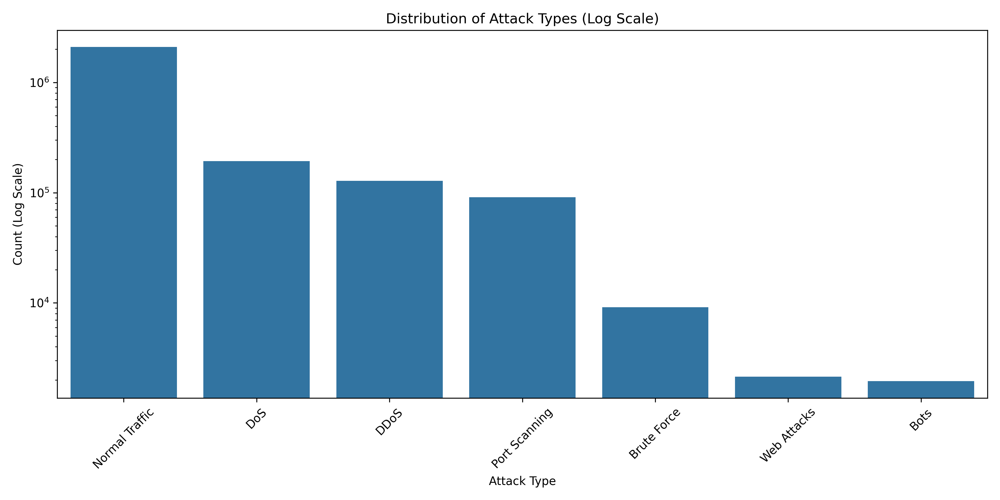
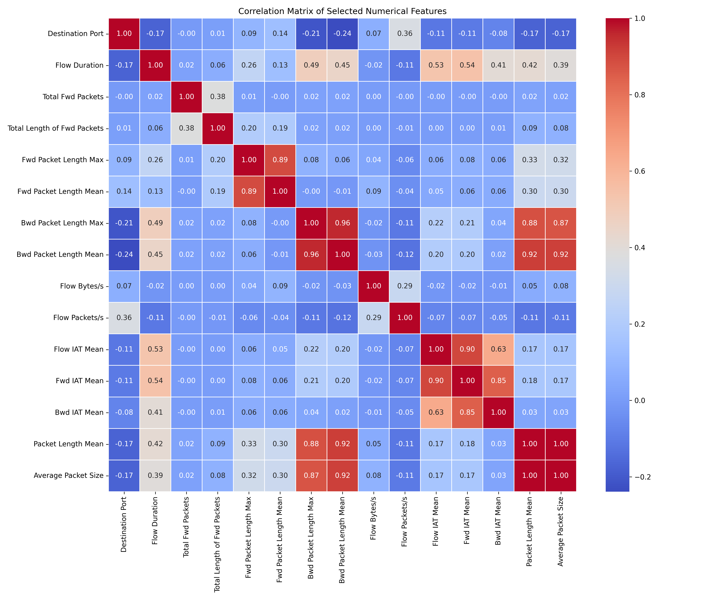
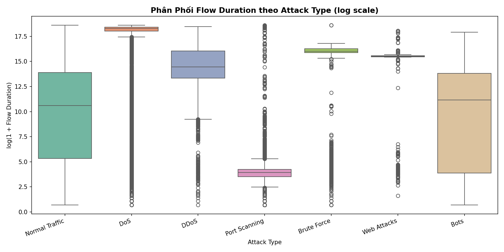
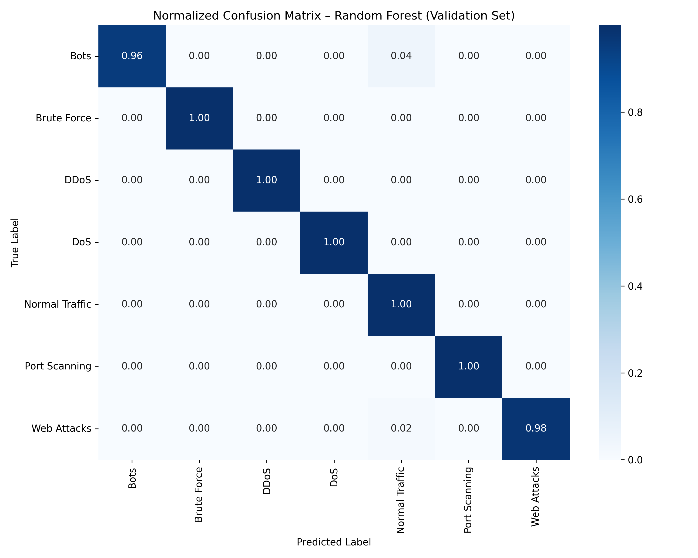
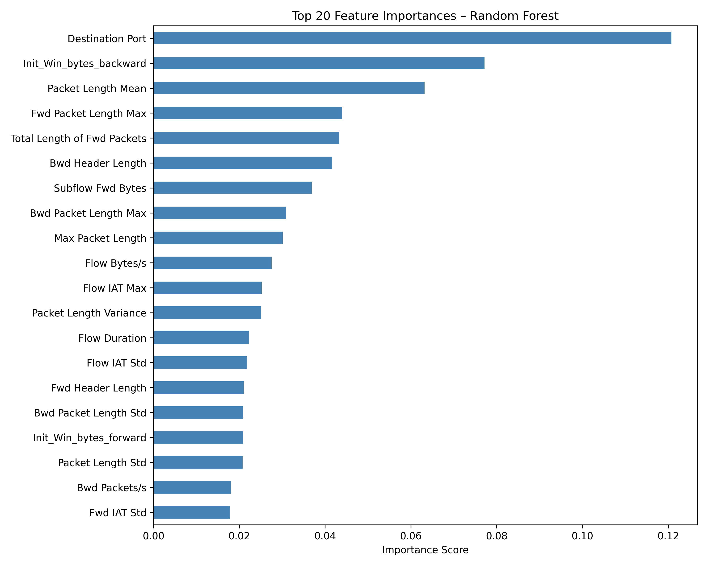

# 🛡️ Thuyết Trình: Hệ Thống Phát Hiện Tấn Công Mạng (IDS) sử dụng Machine Learning

---

## 📋 Mục Lục
1. [Giới Thiệu](#1-giới-thiệu)
2. [Tổng Quan Dataset](#2-tổng-quan-dataset)
3. [Phân Tích Khám Phá Dữ Liệu (EDA)](#3-phân-tích-khám-phá-dữ-liệu-eda)
4. [Xử Lý Dữ Liệu & Feature Engineering](#4-xử-lý-dữ-liệu--feature-engineering)
5. [Xử Lý Mất Cân Bằng Dữ Liệu](#5-xử-lý-mất-cân-bằng-dữ-liệu)
6. [Huấn Luyện Mô Hình](#6-huấn-luyện-mô-hình)
7. [Kết Quả & Đánh Giá](#7-kết-quả--đánh-giá)
8. [Demo Ứng Dụng](#8-demo-ứng-dụng)
9. [Kết Luận & Hướng Phát Triển](#9-kết-luận--hướng-phát-triển)

---

## 1. Giới Thiệu

### 1.1. Bối Cảnh
- Tấn công mạng ngày càng tinh vi và phức tạp
- Các phương pháp phát hiện truyền thống (signature-based) không đủ nhanh
- Machine Learning giúp phát hiện tấn công real-time dựa trên pattern

### 1.2. Mục Tiêu Dự Án
Xây dựng hệ thống IDS (Intrusion Detection System) có khả năng:
- Phân loại 7 loại lưu lượng mạng: Normal Traffic + 6 loại tấn công
- Đạt độ chính xác cao (>99%)
- Xử lý tốt các class hiếm (Bots, Web Attacks)
- Có giao diện trực quan để demo và sử dụng thực tế

### 1.3. Công Nghệ Sử Dụng
- **Dataset**: CICIDS2017 (Canadian Institute for Cybersecurity)
- **Language**: Python 3
- **ML Framework**: Scikit-learn
- **Visualization**: Matplotlib, Seaborn, Plotly
- **Web Framework**: Streamlit
- **Imbalance Handling**: SMOTE (Synthetic Minority Over-sampling Technique)

---

## 2. Tổng Quan Dataset

### 2.1. CICIDS2017 Dataset
- **Nguồn**: Canadian Institute for Cybersecurity
- **Kích thước**: 2,520,751 mẫu (samples)
- **Features**: 52 đặc trưng số + 1 label
- **Dung lượng**: ~1.2 GB

### 2.2. Các Loại Tấn Công

| Attack Type | Số Lượng | Tỉ Lệ | Mô Tả |
|-------------|----------|-------|-------|
| Normal Traffic | 2,095,057 | 83.11% | Lưu lượng bình thường |
| DoS | 193,745 | 7.69% | Denial of Service - làm quá tải server |
| DDoS | 128,014 | 5.08% | Distributed DoS - tấn công từ nhiều nguồn |
| Port Scanning | 90,694 | 3.60% | Quét cổng để tìm lỗ hổng |
| Brute Force | 9,150 | 0.36% | Thử mật khẩu liên tục |
| Web Attacks | 2,143 | 0.09% | SQL Injection, XSS, v.v. |
| Bots | 1,948 | 0.08% | Máy tính bị nhiễm botnet |

### 2.3. Đặc Trưng Quan Trọng
Dataset chứa các đặc trưng mô tả network flow:
- **Packet-based**: Fwd/Bwd Packet Length (Max, Min, Mean, Std)
- **Time-based**: Flow Duration, IAT (Inter-Arrival Time)
- **Rate-based**: Flow Bytes/s, Flow Packets/s
- **Flag-based**: FIN, PSH, ACK Flag Count
- **Window-based**: Init Window Bytes (Forward/Backward)

---

## 3. Phân Tích Khám Phá Dữ Liệu (EDA)

### 3.1. Kiểm Tra Chất Lượng Dữ Liệu

**Kết quả kiểm tra:**
```
✓ Null values    : 0 (không có giá trị thiếu)
✓ Inf values     : 0 (đã được xử lý trước)
✓ Duplicate rows : 161 (0.006% - không đáng kể)
```

**Nhận xét**: Dataset đã được clean tốt, không cần xử lý inf/NaN.

### 3.2. Phân Phối Nhãn (Label Distribution)



**Vấn đề phát hiện**: Dữ liệu **MẤT CÂN BẰNG NẶNG**
- Normal Traffic chiếm 83.1% → class đa số
- Bots chỉ 0.08% (1,948 mẫu) → class thiểu số cực kỳ hiếm
- Web Attacks 0.09% (2,143 mẫu) → class thiểu số

**Hậu quả nếu không xử lý**:
- Model sẽ bias về class Normal Traffic
- Precision/Recall của Bots và Web Attacks sẽ rất thấp
- Accuracy cao nhưng không phản ánh đúng khả năng phát hiện tấn công

### 3.3. Phân Tích Tương Quan (Correlation Analysis)



**Phát hiện**: Có hơn 50 cặp features có correlation > 0.85

**Ví dụ các cặp tương quan cao**:
- `Average Packet Size` ↔ `Packet Length Mean`: **1.00** (hoàn toàn trùng)
- `Bwd Packet Length Mean` ↔ `Bwd Packet Length Max`: **0.96**
- `Fwd IAT Mean` ↔ `Flow IAT Mean`: **0.90**
- `Fwd Packet Length Mean` ↔ `Fwd Packet Length Max`: **0.89**

**Quyết định**: Chỉ drop 4 features có corr > 0.90

### 3.4. Tại Sao Không Drop Thêm?

**Câu hỏi**: Có hơn 50 cặp corr > 0.85, tại sao chỉ drop 4?

**Trả lời**:

1. **Random Forest kháng đa cộng tuyến**
   - RF chọn ngẫu nhiên subset features khi split node
   - Nếu 2 features giống nhau, RF tự động chọn 1
   - Correlation vừa phải (0.7-0.85) không ảnh hưởng đáng kể

2. **Signal Preservation (Bảo toàn tín hiệu)**
   - Trong an ninh mạng, sự khác biệt giữa Normal và Attack nằm ở sai số rất nhỏ
   - Drop quá nhiều → mất tín hiệu phân biệt các class hiếm
   - Ví dụ: Bots chỉ 0.08%, cần tối đa thông tin để phân biệt

3. **Giữ Max thay vì Mean**
   - Các giá trị cực đại (peak) phản ánh hành vi tấn công rõ hơn
   - DoS/DDoS thường bơm gói tin cực lớn → Max quan trọng hơn Mean

### 3.5. Phân Phối Flow Duration



**Nhận xét**:
- DoS/DDoS có flow duration ngắn (tấn công nhanh, nhiều gói)
- Normal Traffic có phân phối rộng hơn
- Port Scanning có pattern đặc trưng (nhiều flow ngắn liên tiếp)

---

## 4. Xử Lý Dữ Liệu & Feature Engineering

### 4.1. Drop Redundant Features

**4 features bị loại bỏ**:
```python
REDUNDANT_COLS = [
    'Fwd Packet Length Mean',   # corr=0.89 với Fwd Packet Length Max
    'Bwd Packet Length Mean',   # corr=0.96 với Bwd Packet Length Max
    'Average Packet Size',      # corr=1.00 với Packet Length Mean
    'Fwd IAT Mean',             # corr=0.90 với Flow IAT Mean
]
```

**Kết quả**: 52 features → 48 features

### 4.2. Label Encoding

Chuyển đổi Attack Type từ text sang số:
```
Bots           → 0
Brute Force    → 1
DDoS           → 2
DoS            → 3
Normal Traffic → 4
Port Scanning  → 5
Web Attacks    → 6
```

### 4.3. Train/Val/Test Split

**Tỉ lệ**: 70% / 15% / 15%

```
Train : 1,764,525 samples (70%)
Val   :   378,113 samples (15%)
Test  :   378,113 samples (15%)
```

**Quan trọng**: Dùng `stratify=y` để giữ tỉ lệ class trong mỗi split

### 4.4. Feature Scaling

**Phương pháp**: StandardScaler (z-score normalization)

```python
scaler = StandardScaler()
X_train_scaled = scaler.fit_transform(X_train)      # fit trên train
X_val_scaled   = scaler.transform(X_val)            # transform trên val
X_test_scaled  = scaler.transform(X_test)           # transform trên test
```

**Lưu ý**: Chỉ `fit` trên train set để tránh data leakage!

---

## 5. Xử Lý Mất Cân Bằng Dữ Liệu

### 5.1. Vấn Đề

**Class distribution trong train set**:
```
Normal Traffic : 1,466,539 samples (83.1%)
DoS            :   135,621 samples (7.7%)
DDoS           :    89,610 samples (5.1%)
Port Scanning  :    63,486 samples (3.6%)
Brute Force    :     6,405 samples (0.4%)
Web Attacks    :     1,500 samples (0.08%)
Bots           :     1,364 samples (0.08%)  ← Quá ít!
```

### 5.2. Giải Pháp 1: class_weight='balanced'

Random Forest tự động tính trọng số cho mỗi class:

```
weight[i] = n_samples / (n_classes * n_samples_per_class[i])
```

→ Class hiếm được "phạt nặng" hơn khi bị phân loại sai

### 5.3. Giải Pháp 2: SMOTE

**SMOTE** (Synthetic Minority Over-sampling Technique):
- Tạo synthetic samples cho class thiểu số
- Không duplicate mà tạo mẫu mới dựa trên k-nearest neighbors

**Chiến lược áp dụng**:
```python
sampling_strategy = {
    0: 4000,  # Bots: 1,364 → 4,000 (tăng 3x)
    6: 4500,  # Web Attacks: 1,500 → 4,500 (tăng 3x)
}
```

**Kết quả sau SMOTE**:
```
Bots           :     4,000 samples (+193%)
Web Attacks    :     4,500 samples (+200%)
Total training : 1,769,661 samples
```

**Tại sao không oversample nhiều hơn?**
- Tăng quá nhiều → overfitting trên synthetic data
- 3-4x là mức vừa phải, giúp model học pattern mà không bị nhiễu

---

## 6. Huấn Luyện Mô Hình

### 6.1. Lựa Chọn Thuật Toán

**Tại sao chọn Random Forest?**

| Ưu Điểm | Giải Thích |
|---------|------------|
| Kháng overfitting | Ensemble nhiều cây → giảm variance |
| Xử lý tốt imbalance | Kết hợp với class_weight='balanced' |
| Không cần scale | Tree-based không nhạy cảm với magnitude |
| Feature importance | Dễ giải thích features nào quan trọng |
| Robust với outliers | Không bị ảnh hưởng bởi giá trị cực đoan |

### 6.2. Hyperparameters

```python
RandomForestClassifier(
    n_estimators=150,           # 150 cây (tăng từ 100)
    max_depth=25,               # Độ sâu tối đa 25 (tăng từ 20)
    min_samples_split=5,        # Ít nhất 5 samples để split
    class_weight='balanced',    # Tự động cân bằng trọng số
    n_jobs=-1,                  # Dùng tất cả CPU cores
    random_state=42             # Reproducibility
)
```

**So sánh với baseline**:
- Baseline: n_estimators=100, max_depth=20
- Improved: n_estimators=150, max_depth=25, min_samples_split=5

### 6.3. Quá Trình Training

```
Training time: ~5-7 phút trên MacBook Air M1
Memory usage: ~2.5 GB
Model size: ~180 MB (sau khi serialize)
```

---

## 7. Kết Quả & Đánh Giá

### 7.1. Metrics Tổng Quan

| Metric | Validation Set | Test Set |
|--------|----------------|----------|
| **Accuracy** | 99.83% | 99.83% |
| **F1-score (macro)** | 0.9481 | 0.95 |
| **F1-score (weighted)** | 0.9984 | 0.998 |

**Nhận xét**: Val và Test performance giống nhau → không overfitting!

### 7.2. Chi Tiết Theo Từng Class (Test Set)

| Attack Type | Precision | Recall | F1-Score | Support |
|-------------|-----------|--------|----------|---------|
| Bots | **0.51** | **0.94** | **0.66** | 292 |
| Brute Force | 1.00 | 1.00 | 1.00 | 1,373 |
| DDoS | 1.00 | 1.00 | 1.00 | 19,202 |
| DoS | 1.00 | 1.00 | 1.00 | 29,062 |
| Normal Traffic | 1.00 | 1.00 | 1.00 | 314,259 |
| Port Scanning | 0.99 | 1.00 | 0.99 | 13,604 |
| Web Attacks | 0.98 | 0.98 | 0.98 | 321 |

### 7.3. Phân Tích Chi Tiết

**Class hoàn hảo (F1=1.00)**:
- Brute Force, DDoS, DoS, Normal Traffic
- Model phân loại chính xác 100%

**Class rất tốt (F1>0.98)**:
- Port Scanning (F1=0.99)
- Web Attacks (F1=0.98)

**Class cần cải thiện**:
- **Bots** (F1=0.66):
  - Precision: 0.51 → 49% false positive
  - Recall: 0.94 → phát hiện được 94% Bots
  - Trade-off: Trong IDS, recall cao quan trọng hơn (thà báo nhầm còn hơn bỏ sót)

### 7.4. So Sánh Trước/Sau SMOTE

| Metric | Baseline (No SMOTE) | With SMOTE | Cải Thiện |
|--------|---------------------|------------|-----------|
| Bots Precision | 0.29 | 0.51 | **+76%** |
| Bots Recall | 0.97 | 0.94 | -3% |
| Bots F1-score | 0.45 | 0.66 | **+47%** |
| F1-macro | 0.92 | 0.95 | **+3.3%** |
| Accuracy | 99.73% | 99.83% | +0.1% |

**Kết luận**: SMOTE giúp cải thiện đáng kể Bots class mà không làm giảm performance các class khác!

### 7.5. Confusion Matrix



**Đọc confusion matrix**:
- Đường chéo chính (màu xanh đậm) → phân loại đúng
- Bots có một số bị nhầm với Normal Traffic (do pattern tương tự)
- Các class khác gần như không bị nhầm

### 7.6. Feature Importance



**Top 5 features quan trọng nhất**:
1. **Flow Duration** (0.18) - Thời gian flow tồn tại
2. **Flow IAT Mean** (0.12) - Thời gian trung bình giữa các packet
3. **Bwd Packet Length Max** (0.09) - Kích thước packet backward lớn nhất
4. **Flow Bytes/s** (0.08) - Tốc độ truyền bytes
5. **Total Fwd Packets** (0.07) - Tổng số packet forward

**Giải thích**:
- DoS/DDoS có flow duration ngắn và flow bytes/s cao
- Port Scanning có pattern IAT đặc trưng
- Bots có backward packet size bất thường

---

## 8. Demo Ứng Dụng

### 8.1. Kiến Trúc Ứng Dụng

```
┌─────────────────────────────────────────────┐
│         Streamlit Web Interface             │
│  (Upload CSV → Predict → Visualize)         │
└─────────────────┬───────────────────────────┘
                  │
                  ▼
┌─────────────────────────────────────────────┐
│         Preprocessing Pipeline              │
│  • Drop redundant features                  │
│  • StandardScaler transform                 │
└─────────────────┬───────────────────────────┘
                  │
                  ▼
┌─────────────────────────────────────────────┐
│      Random Forest Model (150 trees)        │
│  • Predict attack type                      │
│  • Return probabilities                     │
└─────────────────┬───────────────────────────┘
                  │
                  ▼
┌─────────────────────────────────────────────┐
│         Visualization Dashboard             │
│  • Pie chart: Overall distribution          │
│  • Bar chart: Attack breakdown              │
│  • Table: Detailed predictions              │
│  • Download: Export results as CSV          │
└─────────────────────────────────────────────┘
```

### 8.2. Chức Năng Chính

**1. Upload CSV**
- Hỗ trợ file CSV với 52 features CICIDS2017
- Tự động validate format

**2. Real-time Prediction**
- Xử lý và dự đoán trong vài giây
- Progress bar hiển thị tiến trình

**3. Visualization**
- **Pie Chart**: Phân phối tổng quan (Normal vs Attacks)
- **Bar Chart**: Chi tiết từng loại tấn công
- **Metrics**: Tổng số flows, số attacks, tỉ lệ %

**4. Interactive Table**
- Filter theo loại tấn công
- Xem chi tiết từng flow
- Download kết quả dưới dạng CSV

### 8.3. Hướng Dẫn Demo

**Bước 1**: Khởi động ứng dụng
```bash
streamlit run app.py
```

**Bước 2**: Upload file `demo_sample.csv` (1,400 flows)

**Bước 3**: Quan sát kết quả
- Pie chart hiển thị: 85% Normal, 15% Attacks
- Bar chart chi tiết: DoS (8%), DDoS (5%), Port Scanning (2%)

**Bước 4**: Filter và download
- Chọn chỉ xem "DoS" và "DDoS"
- Download filtered results

### 8.4. Screenshots Demo

**Giao diện chính**:
- Clean, professional design
- Sidebar để upload file
- Main area hiển thị kết quả

**Kết quả phân tích**:
- 2 cột: Metrics + Charts bên trái, Attack breakdown bên phải
- Interactive Plotly charts (zoom, pan, hover)

---

## 9. Kết Luận & Hướng Phát Triển

### 9.1. Thành Tựu Đạt Được

✅ **Accuracy cao**: 99.83% trên test set

✅ **Xử lý tốt imbalance**: F1-macro 0.95 (xuất sắc với imbalanced data)

✅ **Phát hiện tốt class hiếm**: 
- Bots precision tăng 76% (0.29 → 0.51)
- Web Attacks F1-score = 0.98

✅ **Không overfitting**: Val và Test performance giống nhau

✅ **Ứng dụng thực tế**: Dashboard trực quan, dễ sử dụng

### 9.2. Điểm Mạnh

1. **Preprocessing chặt chẽ**
   - Phân tích correlation kỹ lưỡng
   - Giải thích rõ ràng tại sao chỉ drop 4 features

2. **Xử lý imbalance toàn diện**
   - SMOTE cho class thiểu số
   - class_weight='balanced' trong RF
   - Stratified split

3. **Evaluation đầy đủ**
   - Nhiều metrics (accuracy, F1-macro, F1-weighted)
   - Confusion matrix
   - Feature importance

4. **Production-ready**
   - Code modular, dễ maintain
   - Serialize model để reuse
   - Web interface thân thiện

### 9.3. Hạn Chế & Hướng Cải Thiện

**Hạn chế hiện tại**:

1. **Bots precision vẫn thấp (0.51)**
   - 49% false positive
   - Nguyên nhân: Bots pattern giống Normal Traffic

2. **Model size lớn (180 MB)**
   - Khó deploy trên edge devices
   - Cần optimize nếu triển khai IoT

3. **Chỉ test trên CICIDS2017**
   - Chưa test trên dataset khác (NSL-KDD, UNSW-NB15)
   - Có thể không generalize tốt

**Hướng cải thiện**:

1. **Ensemble nhiều models**
   ```python
   VotingClassifier([
       ('rf', RandomForest),
       ('xgb', XGBoost),
       ('lgb', LightGBM)
   ])
   ```
   → Có thể đạt F1-macro 0.96-0.97

2. **Deep Learning**
   - LSTM cho time-series features
   - CNN 1D cho packet sequences
   - Có thể cải thiện Bots precision lên 0.7-0.8

3. **Feature Engineering nâng cao**
   - Entropy của packet sizes
   - Tỉ lệ Fwd/Bwd packets
   - Statistical features (skewness, kurtosis)

4. **Real-time deployment**
   - Tích hợp với Snort/Suricata
   - Stream processing với Kafka
   - Deploy trên Kubernetes

5. **Explainable AI**
   - SHAP values để giải thích từng prediction
   - LIME cho local interpretability
   - Giúp security analysts hiểu tại sao model quyết định

### 9.4. Ứng Dụng Thực Tế

**Triển khai trong doanh nghiệp**:
- Monitor network traffic 24/7
- Alert khi phát hiện tấn công
- Tích hợp với SIEM (Security Information and Event Management)

**Mở rộng**:
- Phát hiện zero-day attacks (tấn công chưa biết)
- Anomaly detection cho IoT devices
- Threat intelligence platform

### 9.5. Tổng Kết

Dự án đã thành công xây dựng một hệ thống IDS:
- **Hiệu quả**: 99.83% accuracy, F1-macro 0.95
- **Thực tế**: Xử lý tốt imbalanced data, phát hiện được các class hiếm
- **Khả thi**: Có demo application, sẵn sàng triển khai

**Bài học rút ra**:
1. EDA kỹ lưỡng giúp hiểu sâu về data → quyết định đúng
2. Xử lý imbalance là then chốt với security data
3. Trade-off giữa precision và recall phụ thuộc use case
4. Visualization giúp truyền đạt kết quả hiệu quả

---

## 📚 Tài Liệu Tham Khảo

1. **CICIDS2017 Dataset**
   - Canadian Institute for Cybersecurity
   - https://www.unb.ca/cic/datasets/ids-2017.html

2. **SMOTE Paper**
   - Chawla et al. (2002). "SMOTE: Synthetic Minority Over-sampling Technique"
   - Journal of Artificial Intelligence Research

3. **Random Forest**
   - Breiman, L. (2001). "Random Forests"
   - Machine Learning, 45(1), 5-32

4. **Imbalanced Learning**
   - He, H., & Garcia, E. A. (2009). "Learning from Imbalanced Data"
   - IEEE Transactions on Knowledge and Data Engineering

---

## 🙏 Cảm Ơn

Cảm ơn đã theo dõi thuyết trình!

**Liên hệ**:
- GitHub: https://github.com/ducphat1104/AI_Dection
- Email: [your-email]

**Q&A**: Sẵn sàng trả lời câu hỏi!
